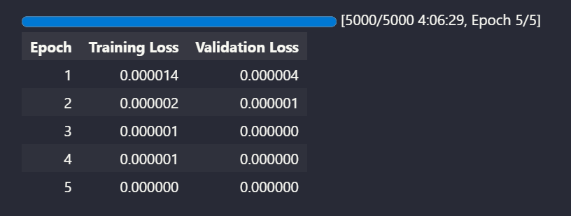
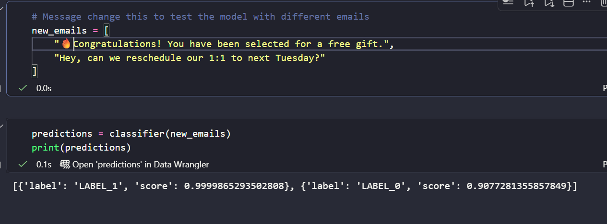

<div align="center">

# Email Spam Detection


</div>


## 📋 About This Project

**THAI:** โปรเจคนี้เกี่ยวกับการใช้การประมวลผลภาษาธรรมชาติในการจำแนกชุดข้อมูลอีเมลสแปม เป้าหมายคือการสร้างโมเดลที่สามารถทำนายได้อย่างแม่นยำว่าอีเมลเป็นสแปมหรือไม่โดยอิงจากคุณสมบัติที่มีในชุดข้อมูล โปรเจคนี้เกี่ยวข้องกับการเตรียมข้อมูล การสร้างโมเดล การฝึกอบรม และการประเมินผลเพื่อให้ได้ความแม่นยำสูงในการตรวจจับสแปม

**ENG:** This project is about using AutoModelForSequenceClassification Model to classify the email spam dataset. The goal is to build a model that can accurately predict whether an email is spam or not based on the features provided in the dataset. The project involves data preprocessing, model building, training, and evaluation to achieve high accuracy in spam detection.

---

## 🛠️ Tool & Technologies

<ul>
<li>Python</li>
<li>Jupyter Notebook</li>
<li>Pandas</li>
<li>Scikit-learn</li>
<li>Transformers</li>
<li>Dataset</li>
</ul>

---

## 🔧 Requirement
You need to install theses libraries to run this project:
<ul>
<li>Pandas</li>
<li>PyTorch</li>
<li>Scikit-learn</li>
<li>Transformers</li>
<li>Dataset</li>
<li>Accelerate</li>
</ul>

```cmd
pip install torch
pip install pandas
pip install -U scikit-learn
pip install transformers
pip install datasets
pip install accelerate
```

## 📈 Training Loss & Validation Loss
The model achieved a loss 0% on the training set after training for 5 epochs. The training and validation loss decreased steadily, indicating that the model was learning effectively. The training loss decreased from around 0.000014% in the first epoch to about 0% in the final epoch, while the validation loss decreased from around 0.000004% to 0%. These results suggest that the model is performing well on the email spam detection task, although there may still be room for improvement with further tuning or additional data.

### Epoch Training Info
</img>

### Labels Prediction
</img>

## 🚀 Getting Started

1. **Clone the repository**

```bash
git clone https://github.com/Saksit-Jittasopee/nlp-spam-email-detection.git
cd nlp-spam-email-detection
```

2. **Run**

<ul>
<li>click 'Run All' to execute all cells in the Jupyter Notebook</li>
</ul>

---
## 📂 Dataset & Model
The dataset used in this project is the **Spam Email Detection Dataset (Clean & ML Ready) Dataset**, which contains a collection of email data with labeled instances of spam and non-spam emails. The dataset includes various features such as subject, email_text, num_words, and etc. which are used to train the AutoModelForSequenceClassification's model for spam detection. The model is trained to identify patterns and anomalies in the data that may indicate spam activity, helping to improve the accuracy of spam detection in email processing.
<h3><a href="https://www.kaggle.com/datasets/ssssws/spam-email-detection-dataset-clean-and-ml-ready" target="_blank">Dataset</a>

---

## 🤝 Connect With Me

<div align="center">

[](https://www.linkedin.com/in/saksit-jittasopee-743981382/)
[](https://github.com/Saksit-Jittasopee)
[](https://www.instagram.com/saksitjittasopee/)
[](https://x.com/theshockedxd)

**⭐ Star this repo if you like it!**

</div>

---

<div align="center">

Made with ❤️ by **Saksit Jittasopee**

_2nd Year DST Student @ Mahidol University_

</div>

